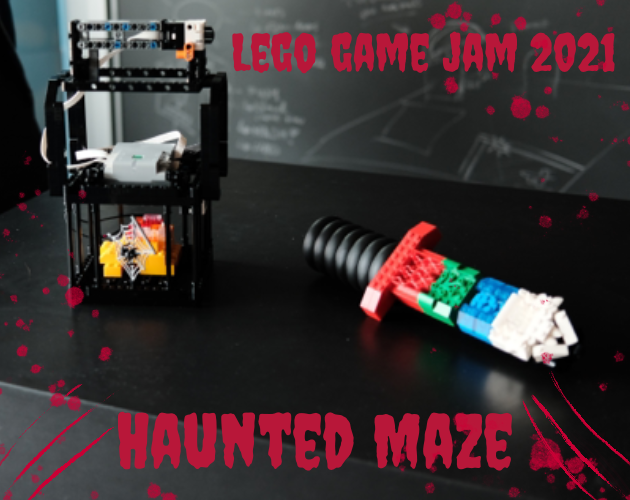

[![LinkedIn][linkedin-shield]][linkedin-url]
[![GitHub][github-shield]][github-url]
[![itch.io][itch-shield]][itch-url]
[![Instagram][instagram-shield]][instagram-url]
[![Youtube][youtube-shield]][youtube-url]
[![ArtStation][artstation-shield]][artstation-url]

<!-- PROJECT LOGO -->
 

  

<h3 align="center">Haunted Maze</h3>

  

    Winner of ITU Lego Game Jam for "Most Innovative Feature" Award.
    The game was created during the Unity x LEGO Game Jam hosted at ITU from 17-19 of September 2021. The project took approximately 36 hours to be developed.
     
     
    >>
    <a href="https://github.com/github_username/repo_name/youtubevideo">View Demo</a>
    .
    <a href="https://barrythecoolbee.itch.io/lego-game-jam">itch.io</a>
    <<
  

<!-- ABOUT THE PROJECT -->
## About The Project

"Haunted Maze" is a 3D Spooky Maze Game with different scenarios and mechanisms for jumpscares. 

The controller is based on a "lantern" composed of a gyroscope sensor that measures the orientation of the lantern (it works similar to a Wii controller).

In addition, it has a force button that measures the force applied when pressing the button, assigning different velocities to the player. 

Lastly, the "lantern" has a colour sensor that reads the colour the player points at it with the "sword". It works like a puzzle solver as it can change the colour of the light in-game and activates different triggers that are dependent on a specific colour. 

(<a href="#top">back to top</a>)

### Built With

* [C#](https://en.wikipedia.org/wiki/C_Sharp_(programming_language))
* [Unity](https://unity.com/)

(<a href="#top">back to top</a>)

## Credits

Programmer - Beatriz Sá 

Programmer - David Grieco

Designer - Kelsey Adsitt

Designer - Mike Omam Petersen

Designer - Patrik Lója

<!-- CONTACT -->
## Contact

Email - beatrizsa1906@gmail.com

Portfolio - Still in Development

Itch.io - [https://barrythecoolbee.itch.io/](https://barrythecoolbee.itch.io/)

LinkedIn - [https://www.linkedin.com/in/beatriz-s%C3%A1-857a64222/](https://www.linkedin.com/in/beatriz-s%C3%A1-857a64222/)

Instagram - [https://www.instagram.com/barrythecoolbee/](https://www.instagram.com/barrythecoolbee/)

Youtube - [https://www.youtube.com/channel/UCuzo8NbNm7MCut_lDQ7WNvw](https://www.youtube.com/channel/UCuzo8NbNm7MCut_lDQ7WNvw)

ArtStation - [https://www.artstation.com/barrythecoolbee](https://www.artstation.com/barrythecoolbee)

Project Link - [https://github.com/barrythecoolbee/LegoGameJam](https://github.com/barrythecoolbee/LegoGameJam)

(<a href="#top">back to top</a>)

[linkedin-shield]: https://img.shields.io/badge/-LinkedIn-black.svg?style=for-the-badge&logo=linkedin&colorB=555
[linkedin-url]: https://www.linkedin.com/in/beatriz-s%C3%A1-857a64222/
[github-shield]: https://img.shields.io/badge/-GitHub-black.svg?style=for-the-badge&logo=github&colorB=555
[github-url]: https://github.com/barrythecoolbee
[itch-shield]: https://img.shields.io/badge/-itch.io-black.svg?style=for-the-badge&logo=itch.io&colorB=555
[itch-url]: https://barrythecoolbee.itch.io/
[instagram-shield]: https://img.shields.io/badge/-Instagram-black.svg?style=for-the-badge&logo=instagram&colorB=555
[instagram-url]: https://www.instagram.com/barrythecoolbee/
[youtube-shield]: https://img.shields.io/badge/-Youtube-black.svg?style=for-the-badge&logo=youtube&colorB=555
[youtube-url]: https://www.youtube.com/channel/UCuzo8NbNm7MCut_lDQ7WNvw
[artstation-shield]: https://img.shields.io/badge/-ArtStation-black.svg?style=for-the-badge&logo=artstation&colorB=555
[artstation-url]: https://www.artstation.com/barrythecoolbee
